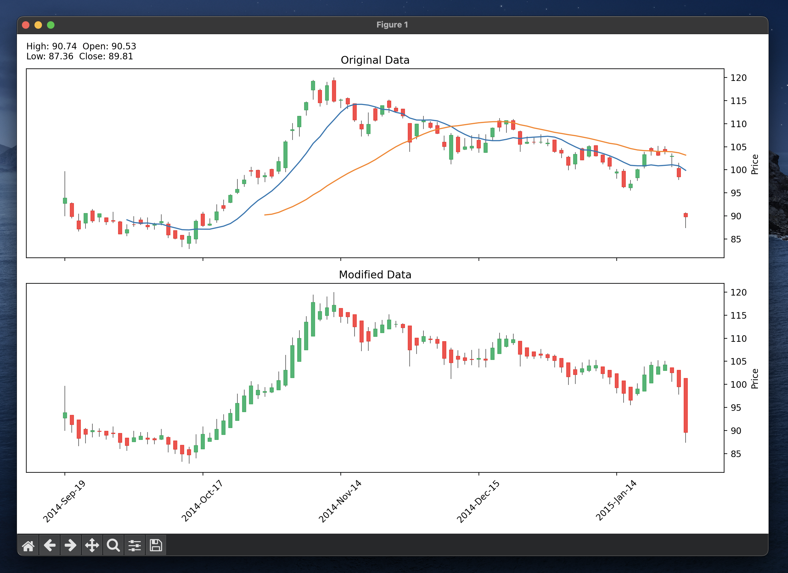
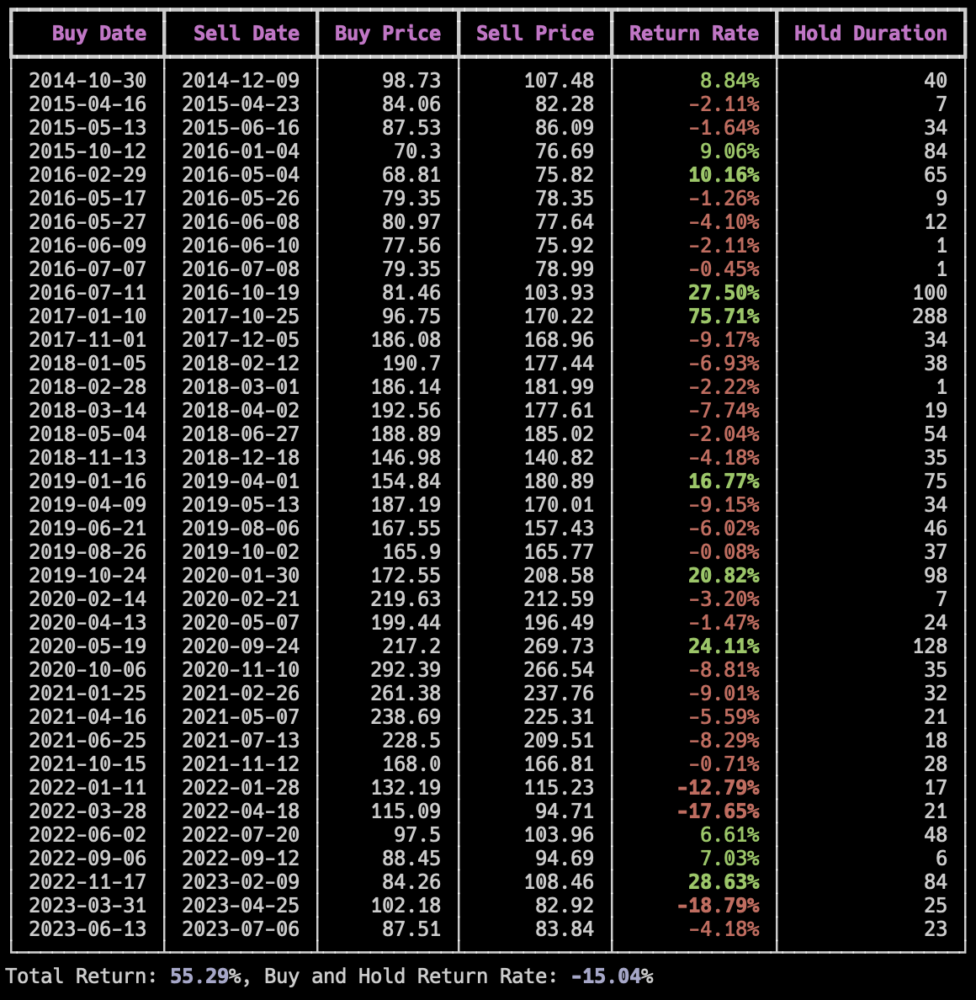

# Short-term trading strategy validation simulator
This project is a stock trading visualization and simulation tool that allows users to interact with historical stock data, visualize it using candlestick charts, and simulate buy/sell operations based on the displayed data.

### Features
Visualize historical stock data in candlestick charts
Display original and derived data side by side
Simulate stock trading with buy and sell operations
Record trading transactions to a CSV file for further analysis

- screen shot

- example output

### Components
The project consists of the following main components:

1. `PrepareData`: Reads and preprocesses historical stock data from a CSV file, calculates derived data, and computes scores and growth rates for each row.
2. `CandlestickChart`: Displays candlestick charts for original and derived data, allowing users to navigate and perform buy/sell operations using keyboard inputs.
3. `TradeManager`: Manages trading transactions (buy and sell operations), calculates profits and losses, and saves the transaction records to a CSV file.

### Installation
To set up the project, follow these steps:

1. Install the required packages:

`pip install pandas mplfinance matplotlib`

2. Download the historical stock data for your desired stock in CSV format. Example sources include Yahoo Finance or Alpha Vantage.
3. Place the downloaded CSV file in an appropriate directory and update the file_path variable in the main script to point to the file.

### Usage
Run the main script:

`python trade_simulation.py --file_path stock_data/apple.csv`

This will launch the visualization window with the candlestick charts. You can navigate through the data and perform buy/sell operations using the following keyboard inputs:

- `l`: Move forward in time
- `j`: Move backward in time
- `b`: Buy stock
- `c`: Sell stock
- `q`: Quit and save transactions to a CSV file

### License
This project is licensed under the MIT License.